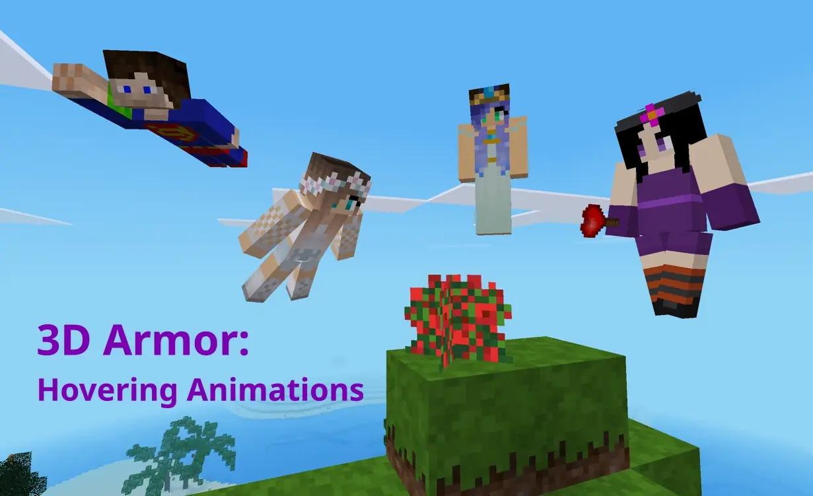

# 3D Armor: Hovering Animations

## Overview

This mod adds hovering, flying, and some other new animations for the player model.
It is a fork of the [3D Armor: Fly & Swim] mod by [sirrobzeroone].
This mod is for players who like playing the Minetest Game in the fly (freemove) mode,
and those who like the gentle floating feeling of flying or staying in the air.

[3D Armor: Fly & Swim]: https://content.luanti.org/packages/sirrobzeroone/3d_armor_flyswim/
[sirrobzeroone]: content.luanti.org/users/sirrobzeroone/

The following player animations and their mining/attacking variants are included.

-   `hover1`, `hover2`: Two variants of standing still in the air.
-   `fly_slow`: Flying slowly.

And the following player animations are taken from the original [3D Armor: Fly & Swim] mod.

-   `swim`: Swimming in liquid
-   `climb`: Climbing climbable objects, including ladders, vines, etc.
-   `duck`: Sneak-move
-   `fall`: Falling down
-   `fly_fast`: Superman-style fast flying

## How to use

The swimming, climbing, falling and sneak-move animations will be used when the player is performing the respective actions.
The flying and hovering animations are only applied to players with the "fly" privilege.
The mod runs on the server side, but there is currently no way for the mod to detect if the client has enabled fly (freemove) mode or not.
So this mod simply uses the "fly" privilege to detect if a player is flying.

You can use the `/3ah_gui` chat command to open a configuration window to customize the flying animations.
There are two variants of hovering animations (`hover1` and `hover2`).
Some player skins look better in one animation than the other.

## Requirements and compatibility

This mod requires the [Minetest Game].
It requires the [3D Armor] (`3d_armor`) and the [SkinsDB] (`skinsdb`) mod.

I tested it on Luanti 5.16.1, but it should work with slightly older versions.

[Minetest Game]: https://content.luanti.org/packages/Luanti/minetest_game/
[3D Armor]: https://content.luanti.org/packages/stu/3d_armor/
[SkinsDB]: https://content.luanti.org/packages/bell07/skinsdb/

## How it works

This mod overrides the "global step" function of Minetest Game's `player_api` and try to determine the player animation according to the player's pressed keys, mouse buttons, current velocity, adjacent objects, etc.

It uses the same algorithm from the Luanti client, based on whether the player is in a liquid or climbable node, to determine if the player is swimming or climbing.
It detectes whether the player is falling based on vertical velocity and the distance from solid nodes below.
When flying, it simply overrides the standing and walking animations.

## Differences from the original 3D Armor: Fly & Swim mod

`3d_armor` and `skinsdb` are required instead of optional dependencies.
This is the first Luanti mod I made,
and I currently don't want to maintain too many animations,
such as one for MTG's default character model, one for `3d_armor`, one for `skinsdb`,
those with capes from the skin, those with capes from the armor, etc.

Capes are removed for multiple reasons.
Firstly, I don't want to maintain multiple models for now.
Secondly, capes can grant the "fly" privilege when wearing them, and revoke it when taking them off.
But this mod is intended to be used in worlds where players always have the "fly" privilege.
Having an item that can revoke the "fly" privilege may have unforeseen consequences.
I am also not sure how it will interact with other mods, such as [Aerial], that grant the player the "fly" privilege.

The ability to sneak into a 1x1 square is removed.
I think this ability modifies the game mechanism, and is orthogonal to this mod which modifies the player animation.
It could be supported by another mod.

The algorithm to detemine whether the player is swimming or climbing is rewritten.

The head animation is rewritten using the new API.
