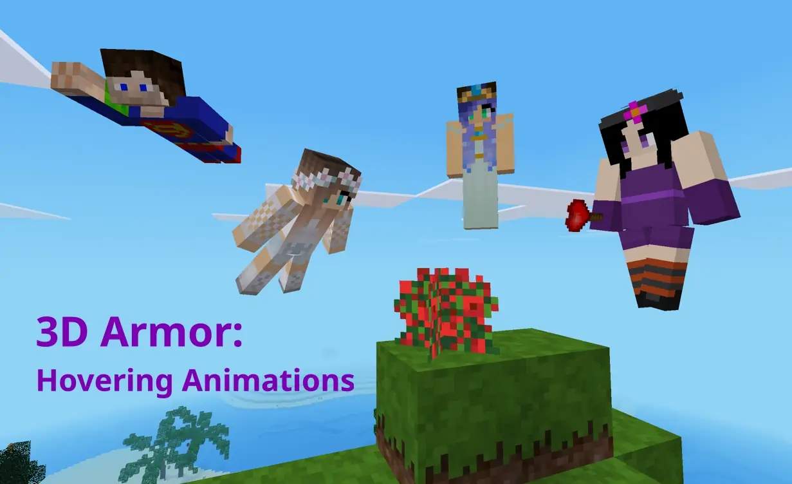
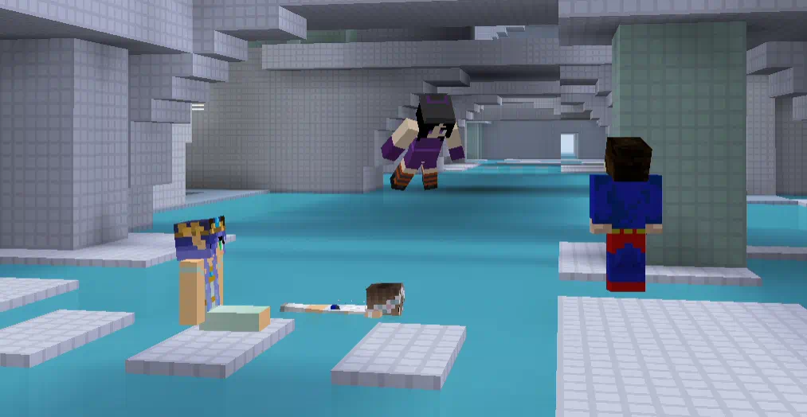
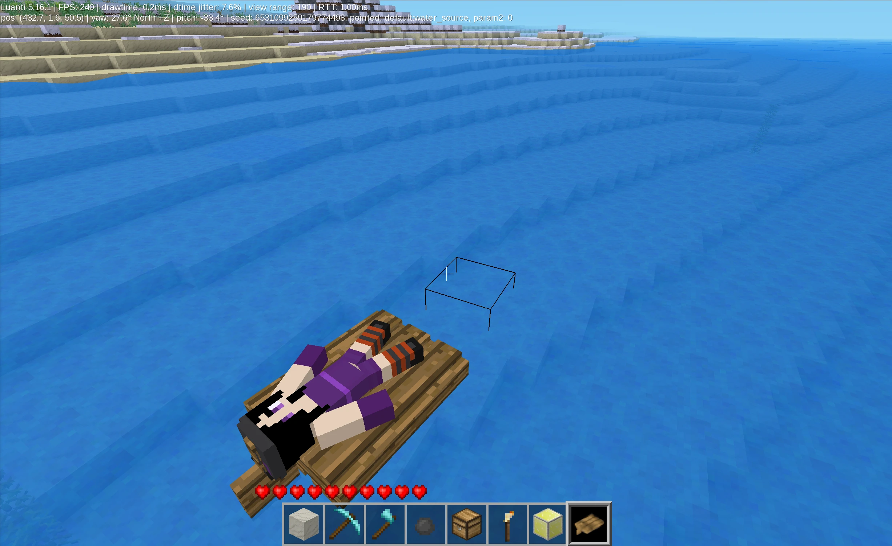
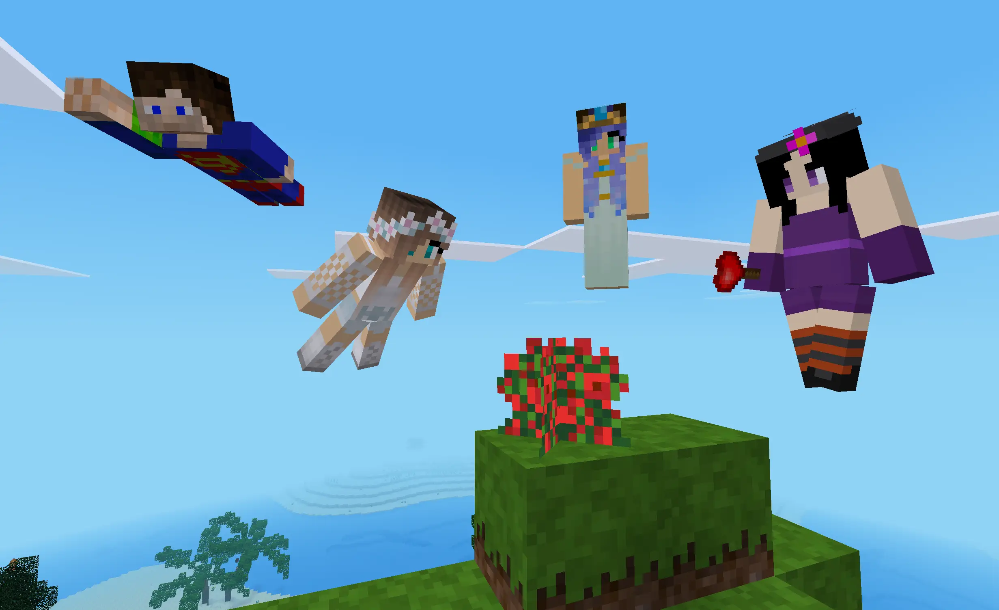
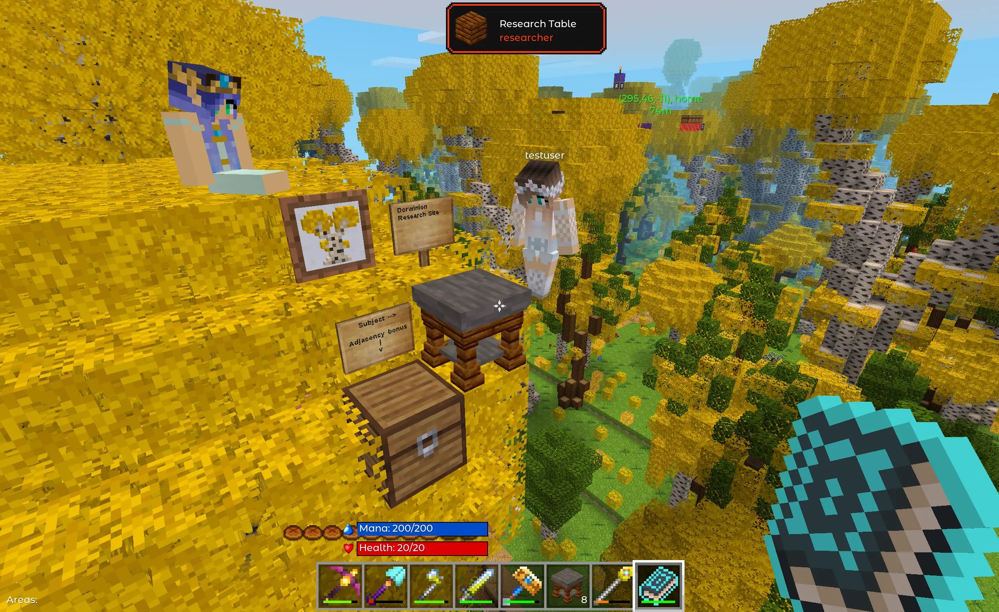
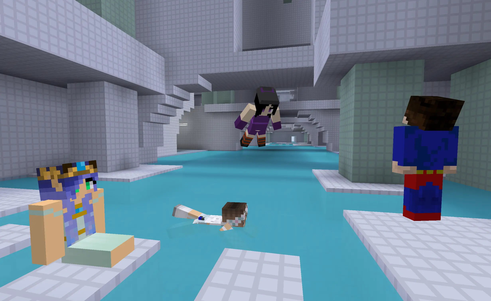

# 3D Armor: Hovering Animations

## Overview

This mod adds hovering, flying, and some other new animations for the player model.
It is a fork of the [3D Armor: Fly & Swim] mod by [sirrobzeroone].
This mod is for players who like playing in the fly (freemove) mode,
and those who like the gentle floating feeling of flying or staying in the air.

[3D Armor: Fly & Swim]: https://content.luanti.org/packages/sirrobzeroone/3d_armor_flyswim/
[sirrobzeroone]: https://content.luanti.org/users/sirrobzeroone/

The following player animations and their mining/attacking variants are included.

-   `hover1`, `hover2`: Two variants of standing still in the air.
-   `fly_slow`: Flying slowly.

And the following player animations are taken from the original [3D Armor: Fly & Swim] mod.

-   `swim`: Swimming in liquid
-   `climb`: Climbing climbable objects, including ladders, vines, etc.
-   `duck`: Sneak-move
-   `fall`: Falling down
-   `fly_fast`: Superman-style fast flying

## How to use

### Basic usage

The swimming, climbing, falling and sneak-move animations will be used when the player is performing the respective actions.

The flying and hovering animations are only applied to players with the "fly" privilege.
The mod runs on the server side, but there is currently no way for the mod to detect if the client has enabled fly (freemove) mode or not.
So this mod simply uses the "fly" privilege to detect if a player is flying.
You can grant yourself "fly" privilege using the chat command `/grantme fly`, or via items from other mods, such as wings from [Aerial] or Flight Potion from [Ethereal].

[Aerial]: https://content.luanti.org/packages/EmptyStar/aerial/
[Ethereal]: https://content.luanti.org/packages/TenPlus1/ethereal/

### Customize animations

You can use the `/3ah_gui` chat command to open a configuration window to customize the flying animations.
There are two variants of hovering animations (`hover1` and `hover2`).
Some player skins look better in one animation than the other.

### Emote

You can use the `/3ah_emote` chat command to play special animations.
Currently supported emotes include `lay`, `sit` and `swim`.
For example, `/3ah_emote lay` will make your character lie down.
Moving or clicking mouse button will cancel the current emote.
A bug (feature?) is currently preventing the emote from being canceled when the player is "tied to" (e.g. in bed, on boat, on horse, etc.).

## Dependencies

There is currently no hard dependencies, but this mod only works with the following supported games:

**[Minetest Game]**: In theory, this mod should work on all games based on MTG, but I have only tested [Asuna] for now.

**[Asuna]**: a Minetest Game derivative.

**[Backrooms Test]**: Don't let the endless maze discourage you.  Try to float in the air and relax.

This mod works well with the following mods:

-   [3D Armor]: for displaying armor and wielded items
-   [SkinsDB]: for selecting skins

I tested it on Luanti 5.16.1, but it should work with slightly older versions.

[Minetest Game]: https://content.luanti.org/packages/Luanti/minetest_game/
[Asuna]: https://content.luanti.org/packages/EmptyStar/asuna/
[Backrooms Test]: https://content.luanti.org/packages/Sumianvoice/backroomtest/
[3D Armor]: https://content.luanti.org/packages/stu/3d_armor/
[SkinsDB]: https://content.luanti.org/packages/bell07/skinsdb/

## Skin selection

When the [SkinsDB] mod is installed, the player skin can be selected using SkinsDB.

However, even if the SkinsDB mod is absent, this mod contains a few bundled skins for the players to use.
They can be selected in the configuration GUI (open with the `/3ah_gui` command).

## How this mod works

This mod overrides the existing "global step" function of the games that determines the player animation.
To support animations beyond the standard ones, such as standing, walking, mining, etc.,
this mod makes decision based on the player's pressed keys, mouse buttons, current velocity, adjacent objects, etc.
For example, if a player is moving in the water, it will play the swimming animation.

It uses the same algorithm from the Luanti client, based on whether the player is in a liquid or climbable node, to determine if the player is swimming or climbing.
It detectes whether the player is falling based on vertical velocity and the distance from solid nodes below.
When flying, it simply overrides the standing and walking animations.

## Differences from the original 3D Armor: Fly & Swim mod

Capes are removed for multiple reasons.
They are an experimental feature of the original [3D Armor: Fly & Swim], and I don't plan to include it for now.

The ability to sneak into a 1x1 square is removed.
I think this ability modifies the game mechanism, and is orthogonal to this mod which modifies the player animation.
It could be supported by another mod.

The algorithm to detemine whether the player is swimming or climbing is rewritten.

The head animation is rewritten using the new API.
This mod also lets the arm point to the looking direction when mining.

## Author and repository

Original work by [sirrobzeroone].

Maintained by [Kunshan Wang (wks)](https://github.com/wks).

Repository: https://github.com/wks/3d_armor_hover
