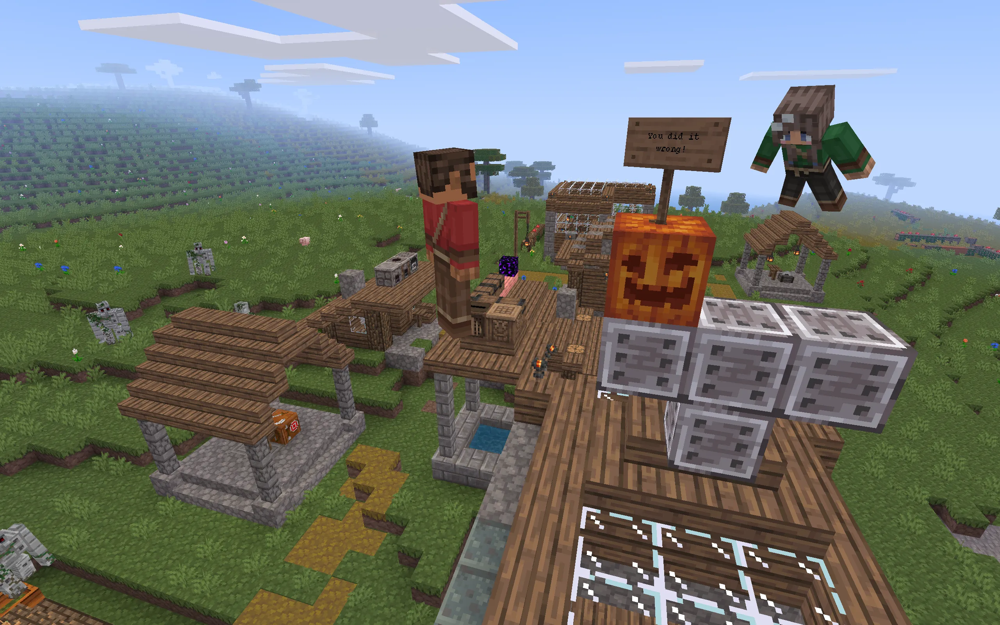

# 3D Armor: Hovering Animations

## Important

Since version 2.0.0, this mod requires Luanti 5.17 or later because it now relies on the new multi-track animations feature.
If you are using older Luanti clients, you should use version 1.5.0 or older.

## Overview

This mod adds hovering and flying animations to the player model,
effectively replacing the default "walking-in-the-sky" animation.
This mod is dedicated to players who like playing the game in the fly mode,
and those who like the gentle floating feeling of flying or staying in the air.

It supports the [Minetest Game] and its derivatives (such as [Asuna] and [Mesecons Lab]),
the [Backrooms Test] game, and has experimental support for [Mineclonia].

It is a fork of the [3D Armor: Fly & Swim] mod by [sirrobzeroone],
therefore it inherited the animations from that mod,
including swimming, climbing, sneak-move, falling and the Superman-style flying animations.

[Minetest Game]: https://content.luanti.org/packages/Luanti/minetest_game/
[Asuna]: https://content.luanti.org/packages/EmptyStar/asuna/
[Mesecons Lab]: https://content.luanti.org/packages/BuckarooBanzay/mesecons_lab/
[Backrooms Test]: https://content.luanti.org/packages/Sumianvoice/backroomtest/
[Mineclonia]: https://content.luanti.org/packages/ryvnf/mineclonia/

[3D Armor: Fly & Swim]: https://content.luanti.org/packages/sirrobzeroone/3d_armor_flyswim/
[sirrobzeroone]: https://content.luanti.org/users/sirrobzeroone/

## How to use

### Basic usage

Make sure the game is in the supported games list (see below).

The flying and hovering animations are only used when the player has the "fly" privilege.
You can grant yourself "fly" privilege using the chat command `/grantme fly` in single-player games.  Alternatively, you can get the "fly" privilege from items from other mods, such as Wings from [Aerial] or Flight Potion from [Ethereal].

Note that if you turn off "fly mode" on your Luanti client while you still have the "fly" provilege, your character will still appear to be floating.
This is expected because this mod runs on the server side.
Due to the way Luanti servers and clients work, there is currently no way for the mod to detect if the client has enabled fly (freemove) mode or not.
So this mod simply uses the "fly" privilege to detect if a player is flying.

[Aerial]: https://content.luanti.org/packages/EmptyStar/aerial/
[Ethereal]: https://content.luanti.org/packages/TenPlus1/ethereal/

### Customize animations

You can use the `/3ah_gui` chat command to open a configuration window to customize the flying animations.
Some animations have multiple variants, such as `hover` and `hover2`, `fly_slow` and `fly_slow2`, etc.
Some player skins look better with one variant than the other.

### Emote

You can use the `/3ah_emote` chat command to play animations at your choice.
Currently supported emotes include `lay`, `sit` and `swim`.
For example, `/3ah_emote lay` will make your character lie down.
Moving or clicking mouse button will cancel the current emote.

Emote will override the animation when the player is attached to
(e.g. in bed, on boat, on horse, etc.).
For example, invoking `/3ah_emote lay` when the player is driving a boat will make the player lie on the boat.

## Supported Luanti version

Since version 2.0.0, this mod requires Luanti 5.17.0 or later.
It is primarily because this mod makes heavy use of the multi-track animations feature.

## Supported games

This mod works with the following games:

**[Minetest Game]**: The game this mod and its predecessor [3D Armor: Fly & Swim] was initially designed for.
This mod integrates well with the [3D Armor] mod (where the name of this mod comes from) and the [SkinsDB] mod.
In theory, this mod should work on all games based on MTG, but I have only tested the following derivatives:

-   **[Asuna]**
-   **[Mesecons Lab]**

[3D Armor]: https://content.luanti.org/packages/stu/3d_armor/
[SkinsDB]: https://content.luanti.org/packages/bell07/skinsdb/

**[Backrooms Test]**: This mod simply replaces the player character, and should work out of the box.
Don't let the endless maze discourage you.
Try to float in the air, and it can be quite relaxing, especially on level 37 as shown in the screenshot.

**[Mineclonia]**: Support for Mineclonia is very experimental for now.
It can use the skin from Mineclonia's skin editor, but can also use the bundled skins when Player Skin Customization is disabled on the server.
Conventional armors work, but elytra doesn't work as expected.
(But you probably won't use elytra anyway if you can just fly.)
Wielded items, bow/crossbow shooting, shield blocking are not implemented, yet.

## Skin selection

### SkinsDB

When the [SkinsDB] mod is installed, the player skin can be selected using SkinsDB.

### Mineclonia skin customization

[Mineclonia] allows the player to customize the skin, and this mod supports it.
If "Player skin customization" is disabled in settins, this mod can still use Mineclonia's default skin or bundles skins (see below).

### Bundled Skins

This mod contains a few bundled skins for the players to use when there are no other ways (SkinsDB or Mineclonia's skin editor) to select skins.
Use this mod's configuration GUI (opened with the `/3ah_gui` command) to select from bundled skins.

## How this mod works

Existing games set the player model during initializtion,
and select animations at regular intervals of 0.1 seconds.
Animations are selected based on player's pressed keys, mouse buttons, current velocity, adjacent nodes, etc.
For example, if the player is holding the forward key, the game will select the walking animation.

This mod customizes the player model and animations essentially by suppressing the model selection and animation selection of the games.
To do it, this mod overrides some fuctions of the games so that the games cannot select the player model or animations.
Then this mod provides its own model, and selects animation using its own logic.
For example, if a player has the "fly" privilege and is holding the forward key, this mod will select the flying animation which may not exist in the game.

Because the set of functions to override defers from game to game, each game has to be supported separately.
This is why this mod only supports certain games in the list in previous sections.

This mod uses the algorithm from the Luanti client to to determine if the player is swimming, climbing or falling.
For example, if the player is in a liquid or climbable node, it will be considered swimming or climbing.
If the player's downward velocity is greater than the threshold at which the player will take fall damage, it will play the falling animation.

## Differences from the original 3D Armor: Fly & Swim mod

In addition to added features, such as hovering / flying animations and emote, this mod also differs from the original [3D Armor: Fly & Swim] in several ways.

The character model file is reorganized to support multi-track animations.
Mining, for example, is now on a dedicated track and it will override the right arm movement of other animations, such as walking and swimming.
This avoids the combinatorial explosion of moving × interacting.

`player_api` (from Minetest Game) is no longer a hard dependency.
This mod supports several games.

Capes are removed for multiple reasons.
They are an experimental feature of the original [3D Armor: Fly & Swim], and I don't plan to include it for now.

The ability to sneak into a 1x1 square is removed.
I think this ability modifies the game mechanism, and is orthogonal to this mod which modifies the player animation.
It could be supported by another mod.

The algorithm to detemine whether the player is swimming, climbing or falling is rewritten.

The head animation is rewritten using the new API.
This mod also lets the arm point to the looking direction when mining.

## Author and repository

Original work by [sirrobzeroone].

Maintained by [Kunshan Wang (wks)](https://github.com/wks).

Repository: https://github.com/wks/3d_armor_hover
